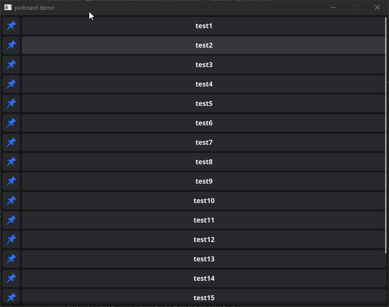

# About
These are experimental Fyne components and extensions I maintain and use in my own personal projects that I spent a lot of time on and would love to share with other Fyne developers. 

You may find some of these components useful for your project. You are free to use this repository or copy and modify anything here provided you store the files in the [licenses](licenses) somewhere along with your source or redistribution.  

You may not want to directly rely on this repository though as all of these widgets are currently experimental and may change at any moment for any reason. Either use git submodule and pin a version or copy the code you need to your project.

That being said I will try to indicate which widgets are likely to remain stable vs are undergoing rapid changes currently.

# Widgets
## PinBoard

This nifty widget is similar to the fyne Accordion widget, it is a list which each item can be expanded to show a different subitem.  However, the view is always a vertical scroller filling to the available size where placed, each item can be **pinned* so they will always remain in the scrollable viewport sticking to the top or bottom of the view as the scroll area would normally pass the pin item.

The purpose is to keep the ordering context of data and keep what is important on screen.  I use this for a window to debug lines in a data stream where only some lines are of interest but they can be far apart in chronological order, but that order matters.

### PinBoard TODO:
The PinItem and PinBoard callbacks for library users isn't settled, and some tests need to be written for that functionality.

# FAQ

## Why aren't these components part of Fyne/Fyne-x?
I rather not maintain these, but most of these components I feel like are cool enough to share. However they are rough, or crunchy, around the edges. Once I spend some time with the widgets and learn more about Fyne and improve upon them, I want to push them to fyne-x or if appropriate see if it makes sense what to contribute back all the way to the parent Fyne project.

# Other Resources
**[Fyne](https://github.com/fyne-io/fyne)**: An easy-to-use UI toolkit and app API written in Go.
It is designed to build applications that run on desktop and mobile devices with a
single codebase. This is the framework Fyne-Crunch widgets fit into.

**[Fyne-x](https://github.com/fyne-io/fyne-x)**:This repository holds community extensions for the Fyne toolkit. This is the likely target for components I maintain here when I feel like they are stable, performant, have a good usage, and are more idiomatic to Fyne.

